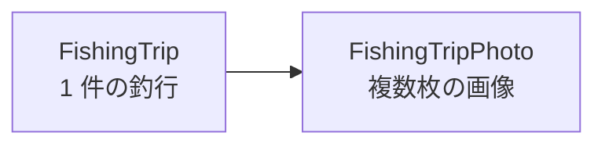

# Laravel × FileMaker で使う釣行モデル設計

この資料は、教材として使う
「ユーザー自身の釣行を登録・修正・削除するフォーム」と
「アップロード済みの釣行を表示する一覧」
を作るための、最初のモデル設計を整理したものです。

最初から複雑にしません。
まずは
`釣行本体`
と
`釣行画像`
の 2 モデルで始めます。

## 1. まずは 2 モデルで作る

| 用途 | FileMaker テーブル | Laravel モデル |
| --- | --- | --- |
| 釣行本体 | `fishing_trips` | `FishingTrip` |
| 釣行画像 | `fishing_trip_photos` | `FishingTripPhoto` |

この分け方にする理由はシンプルです。

- 釣行の基本情報は 1 件にまとまる
- 魚の画像は 1 件の釣行に対して複数枚ぶら下がる
- 画像を複数持たせるために、`Container` の繰り返しフィールドではなく子テーブルにする

## 2. モデルの関係

- `FishingTrip` が親
- `FishingTripPhoto` が子
- 1 つの釣行に対して、画像を 0 枚以上登録できる

## 3. `FishingTrip` のフィールド

FileMaker テーブル名は `fishing_trips` を想定します。

| フィールド名 | 型 | 必須 | 用途 |
| --- | --- | ---: | --- |
| `id` | Text | ○ | 釣行の主キー。カラム名は Laravel デフォルトに合わせ、値は `Get(UUID)` で採番する想定 |
| `user_id` | Text | ○ | その釣行の所有者ユーザー ID |
| `trip_date` | Date | ○ | 釣行日 |
| `start_at` | Timestamp | ○ | 釣行開始日時 |
| `end_at` | Timestamp | ○ | 釣行終了日時 |
| `river_name` | Text | ○ | 河川名 |
| `point_name` | Text | ○ | ポイント名 |
| `tackle_name` | Text | ○ | 使用タックル |
| `memo` | Text |  | メモ、釣行記録 |
| `created_at` | Timestamp | ○ | 作成日時 |
| `updated_at` | Timestamp | ○ | 更新日時 |

### この設計で押さえたいこと

- `user_id` は認可のために必要
- `river_name`、`point_name`、`tackle_name` は最初は `Text` で十分
- `trip_date` と `start_at` と `end_at` を分けることで、一覧表示と入力の両方が扱いやすい

## 4. `FishingTripPhoto` のフィールド

FileMaker テーブル名は `fishing_trip_photos` を想定します。

| フィールド名 | 型 | 必須 | 用途 |
| --- | --- | ---: | --- |
| `id` | Text | ○ | 画像レコードの主キー。カラム名は Laravel デフォルトに合わせ、値は `Get(UUID)` で採番する想定 |
| `fishing_trip_id` | Text | ○ | 親の `fishing_trips.id` とつなぐための外部キー |
| `image` | Container | ○ | 魚の画像本体 |
| `caption` | Text |  | 画像の説明文 |
| `sort_order` | Number | ○ | 一覧表示用の並び順 |
| `created_at` | Timestamp | ○ | 作成日時 |
| `updated_at` | Timestamp | ○ | 更新日時 |

### この設計で押さえたいこと

- 画像を複数登録したいので、親テーブルに `Container` を増やさない
- `sort_order` を持たせると、一覧の表示順を制御しやすい
- 代表画像が欲しい場合は、`sort_order = 1` を先頭画像として扱える

## 5. 認可のために必要な考え方

この教材では
「ユーザー自身の釣行だけ編集・削除できる」
という設計にしたいので、
`FishingTrip` に `user_id` が必要です。

判定の基本は次の形です。

- 一覧表示: ログイン中ユーザーの釣行だけ取得する
- 詳細表示: 必要なら `Policy` で閲覧可否を判定する
- 更新、削除: `user_id === ログイン中ユーザー ID` を `Policy` で判定する

つまり、認可の中心は `FishingTrip` 側に置きます。
画像の更新や削除も、最終的には親の釣行にぶら下がるデータとして扱うと整理しやすくなります。

## 6. 楽観的排他のために必要な考え方

更新競合の対策としては、
まず `updated_at` を持たせておくと整理しやすいです。

ただし、FileMaker で本格的に楽観的排他を扱うなら、
テーブルフィールドを増やすよりも
`modId` を使う方が自然です。

### ここでの考え方

- 画面表示時に FileMaker の `modId` を保持する
- 更新時に、その `modId` が最新か確認する
- 別ユーザーが先に更新していたら、保存せず競合として扱う

つまり、楽観的排他のために必須なのは
「専用フィールドを増やすこと」ではなく、
「更新時に比較する値を持つこと」です。

## 7. なぜこの形で始めるのか

最初の教材として重要なのは、
マスタや細かい分類を増やすことではなく、
更新処理の責務を見えるようにすることです。

この 2 モデル構成なら、
次のことを素直に学べます。

- `CRUD` の基本
- `Policy` による認可
- 複数画像を含む保存処理
- 一覧表示の組み立て
- 楽観的排他の考え方

## 8. 今はまだ増やさなくてよいもの

次のようなものは、最初の教材では後回しで構いません。

- 河川マスタ
- ポイントマスタ
- タックルマスタ
- 魚種、サイズ、匹数の専用テーブル

まずは
`1 件の釣行`
と
`その釣行に紐づく複数画像`
を扱える状態を作るのが先です。

## 9. この教材で使う最小構成

最初に作るテーブルは次の 2 つです。

1. `fishing_trips`
2. `fishing_trip_photos`

最小フィールドは次の考え方で十分です。

- 釣行本体: `id`、`user_id`、`日付`、`開始`、`終了`、`河川`、`ポイント`、`タックル`
- 画像: `id`、`fishing_trip_id`、`画像本体`、`並び順`

この形にしておくと、次の段階で
Laravel 側の `Model`、`Policy`、`Controller`、`Request`
へ自然につなげられます。
