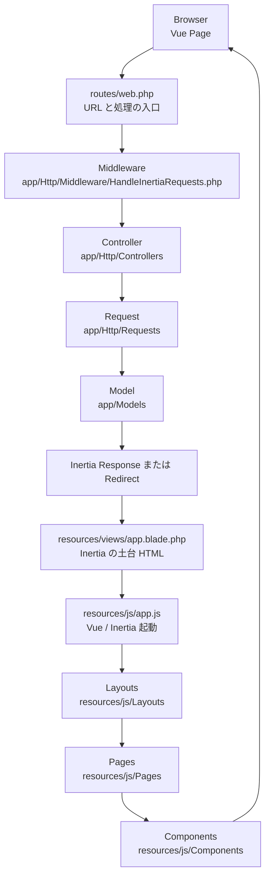
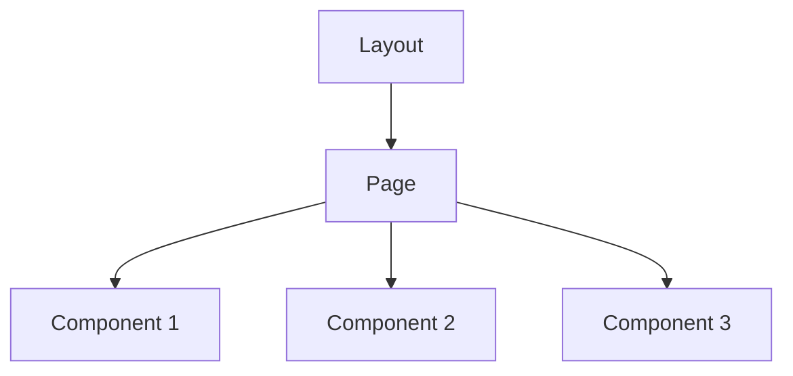
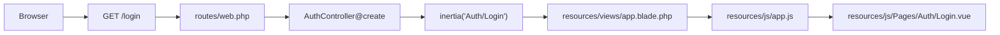
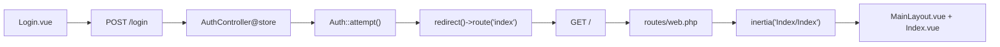
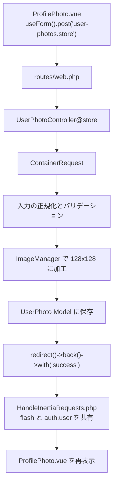
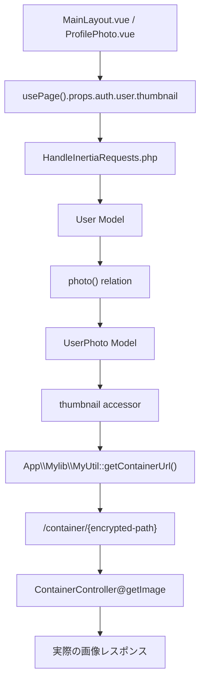

# Laravel + Inertia + Vue のデータの流れ

この資料は、このプロジェクトを題材にして
`Laravel + Inertia + Vue` の流れを初心者向けに整理したものです。

派手なことはしていません。
まずは「どこが入口で、どこが画面で、どこがデータ担当か」を見えるようにするのが目的です。

## 1. まずは全体像

### ひとことで言うと

- `routes` は URL の案内板
- `Controller` は処理の司令塔
- `Request` は入力チェック係
- `Model` はデータ担当
- `Middleware` は全ページ共通のデータを渡す係
- `resources/js/Pages` は実際の画面
- `resources/js/Layouts` は画面の外枠
- `resources/js/Components` は画面の部品

## 2. Page / Layout / Component の違い

まだこのプロジェクトには `resources/js/Components` はありません。
ただ、今のうちに考え方だけ入れておくと整理しやすいです。

### 役割の違い

- `Layout`
  ヘッダー、共通余白、全体枠など、どのページでも共通の部分
- `Page`
  その URL 専用の画面本体
- `Component`
  Page の中で繰り返し使いたい小さな部品

### 今回の例で言うと

- `MainLayout.vue` は Layout
- `Index.vue` と `User/ProfilePhoto.vue` は Page
- もし今後
  `UserCard.vue`
  `PageHeader.vue`
  `FlashMessage.vue`
  のような部品を切り出したら、それが Component

### どんなときに Component に切り出すか

- 同じ見た目を複数ページで使う
- 1 ページの template が長くなりすぎた
- 「この塊は 1 つの部品」として名前を付けた方が読みやすい

### 逆に今は切り出さなくてよい場合

- そのページでしか使わない
- まだ小さい
- 分けると逆に追いにくくなる

なので最初は

`Layout -> Page`

だけでも十分です。
そこから必要になったら

`Layout -> Page -> Component`

へ進めばよいです。

## 3. このプロジェクトでの基本フロー

### 3-1. ログイン画面を開く流れ

### 3-2. ログイン後に Home を開く流れ

### ポイント

- ログイン処理は `AuthController@store` が担当する
- 認証自体は `Auth::attempt()` が行う
- 成功したら `index` へリダイレクトする
- `index` は `resources/js/Pages/Index/Index.vue` を表示する

## 4. プロフィール画像アップロードの流れ

このプロジェクトでは、プロフィール画像の登録ページは
`resources/js/Pages/User/ProfilePhoto.vue` です。

### ここで何をしているか

- Vue 側は `useForm()` でファイルを送る
- Laravel 側は `ContainerRequest` で入力を受ける
- `UserPhotoController@store` で画像を加工して保存する
- 保存後は JSON を返すのではなく、`redirect()->back()` で同じ画面へ戻す
- Inertia が再描画し、`flash.success` や最新のユーザー情報が Vue 側に渡る

## 5. サムネイル表示の流れ

このプロジェクトでは、FileMaker のコンテナ URL をそのままブラウザへ出さず、
一度 Laravel を通す形にしています。

### ここで大事なこと

- Vue は FileMaker の生 URL を知らない
- `thumbnail` は Model の accessor で整形される
- `MyUtil` は URL を暗号化して Laravel の `container` ルートに変換する
- `ContainerController` が最終的に画像を取りにいって返す

## 6. 指定されたディレクトリの役割

| ディレクトリ | 役割 | このプロジェクトでの例 |
| --- | --- | --- |
| `app/Http/Controllers` | リクエストを受けて、何を返すか決める場所 | `AuthController`, `UserPhotoController`, `ContainerController` |
| `app/Http/Middleware` | 全ページ共通の処理や共通データを挟む場所 | `HandleInertiaRequests` で `auth.user` と `flash.success` を共有 |
| `app/Http/Requests` | 入力値を整える・バリデーションする場所 | `ContainerRequest` が画像ファイルや base64 を受ける |
| `app/Models` | データを扱う場所 | `User`, `UserPhoto` が FileMaker データを扱う |
| `app/Facades` | サービスクラスを Laravel らしい書き方で呼び出すための窓口 | `MyUtilFacade` |
| `app/Mylib` | 小さな独自処理をまとめる場所 | `MyUtil` が FileMaker コンテナ URL を Laravel 用 URL に変換 |
| `app/Services` | ビジネスロジックが増えたときに、Controller から処理を分離する場所 | 今は未作成。たとえば `UserPhotoService` など |
| `app/Support` | 汎用的な補助クラスを置く場所 | 今は未作成。共通変換、ヘルパー、値オブジェクト候補など |
| `app/Providers` | サービス登録やアプリ全体の初期設定を置く場所 | `AppServiceProvider` で `MyUtil` を bind、HTTP 設定を追加 |
| `config` | 各種設定ファイルを置く場所 | `auth.php`, `app.php`, `my.php` |
| `resources` | 画面に関するファイルを置く場所 | `views/app.blade.php`, `js/app.js`, `js/Pages`, `js/Layouts`, `css/app.css` |
| `resources/js/Components` | Page の中で使う小さな UI 部品を置く場所 | 今は未作成。将来の `UserCard.vue` など |
| `routes` | URL と処理の対応表 | `web.php` |

## 7. ファイルごとに初心者向けに言い換える

### `routes/web.php`

- 「この URL が来たら、どこへ渡すか」を決める
- 入口そのもの

### `app/Http/Controllers`

- Route から渡されたあとに最初に考える場所
- 画面を返すのか、保存するのか、リダイレクトするのかを決める

### `app/Http/Middleware/HandleInertiaRequests.php`

- 全ページで使いたいデータを Vue 側へ渡す
- たとえばログイン中ユーザー情報はここで共有している

### `app/Http/Requests/ContainerRequest.php`

- Controller に入る前に「入力が正しいか」を確認する
- base64 で来た画像を `UploadedFile` に変換する役割もある

### `app/Models/User.php`, `app/Models/UserPhoto.php`

- FileMaker のデータを Laravel から触りやすくする
- relation や accessor もここに置く

### `app/Facades/MyUtilFacade.php`

- `MyUtil` を Facade 経由で呼ぶための入口
- 「クラスを直接 new する」のではなく、Laravel の仕組みに乗せて呼び出したいときに使う

### `app/Mylib/MyUtil.php`

- Model や Controller にベタ書きしたくない小さな共通処理を分ける
- 今回は FileMaker コンテナ URL を安全なアプリ用 URL に変換している

### `app/Services`

- 今は無くてもよい
- ただし、ビジネスロジックが増えたら Controller に全部書かないための逃がし先になる
- たとえば「画像加工して保存する処理」がもっと複雑になったら `UserPhotoService` のように分けやすい

### `app/Support`

- 今は無くてもよい
- `Services` ほど業務ロジックではないけれど、再利用したい補助クラスを置く場所
- たとえば共通フォーマッタ、変換クラス、小さなユーティリティなど

### `app/Providers/AppServiceProvider.php`

- 自作クラスをコンテナへ登録する
- アプリ共通の初期設定をまとめる

### `config`

- コードではなく設定を書く場所
- たとえば locale、auth、独自設定 `my.verify_ssl` など

### `resources/views/app.blade.php`

- Inertia アプリ全体の HTML の土台
- Vue の各ページそのものはここには直接書かない

### `resources/js/app.js`

- Vue と Inertia の起動ファイル
- `Pages` を読み込み、`Layouts` を適用する

### `resources/js/Layouts`

- ヘッダーや余白など、画面の共通の外枠を置く

### `resources/js/Pages`

- 実際の 1 ページごとの画面を置く
- 今の例では `Auth/Login.vue`, `Index/Index.vue`, `User/ProfilePhoto.vue`

### `resources/js/Components`

- Page の中で使う部品を置く
- たとえばプロフィールカード、共通見出し、通知メッセージなど
- まだ無理に作らなくてよいが、Page が長くなってきたら候補になる

## 8. 初心者向けの覚え方

### まず覚える順番

1. `routes/web.php`
2. `Controller`
3. `Inertia`
4. `resources/js/Pages`
5. `HandleInertiaRequests`
6. `Request`
7. `Model`

### 理由

- 最初に URL と画面のつながりを理解する
- その次に「保存処理」の流れを理解する
- いきなり Model や Provider から入ると、全体像が見えにくい

## 9. この構成で大事な線引き

- `Layout` は外枠
- `Page` はそのページ固有の見た目
- `Component` は Page の中の部品
- `Controller` は処理の流れを決める
- `Request` は入力チェック
- `Model` はデータ
- `Middleware` は共通データ
- `Services` は太ったビジネスロジックの分離先
- `Support` は再利用したい補助処理の置き場

この線引きが崩れると、
「どこで何をしているのか」が分かりにくくなります。

## 10. Controller に何でも書かないための考え方

初心者のうちは、まず Controller に書いて流れを理解するのは悪くありません。
ただし、処理が増えてきたら全部を Controller に入れ続けると読みにくくなります。

### 目安

- 入力チェックは `Request`
- DB や FileMaker のデータ操作は `Model`
- 画面を返す、リダイレクトする判断は `Controller`
- 業務処理が長くなったら `Services`
- 便利道具として再利用したいものは `Support` や `Mylib`

### たとえば今回の画像登録で考えると

- 「HTTP リクエストを受ける」は `UserPhotoController`
- 「ファイル形式を確認する」は `ContainerRequest`
- 「画像を 128x128 に加工して保存する」が今後もっと複雑になるなら `UserPhotoService`
- 「FileMaker の URL を安全な URL に変換する」は `MyUtil`

## 11. このプロジェクトで特にハマりやすい点

- Inertia を使っているのに API 的な考え方で JSON を返したくなる
- 共有データを `HandleInertiaRequests` ではなく各 Page にばらばらに書きたくなる
- Route を増やしたのに `resources/js/ziggy.js` を更新し忘れる
- Page がやるべき見た目を Layout に入れすぎる

## 12. まとめ

このプロジェクトの基本は次の一文で言えます。

> Route が入口を決め、Controller が流れを決め、Request が入力を守り、Model がデータを扱い、Middleware が共通データを配り、Inertia が Vue Page へつなぐ。

まずはこの一本の流れを見失わないことが大事です。
